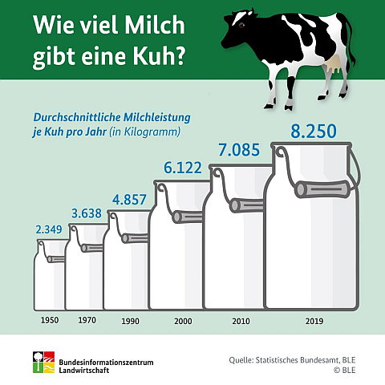
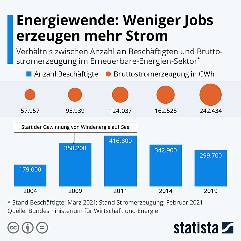

class: title-slide

```{r xaringan-themer, include=FALSE}
library(xaringanthemer)
style_xaringan(text_color = "#232461",inverse_text_color = "#FFFFFF",inverse_background_color = "#232461", title_slide_background_color = "#232461",header_background_color = "#232461",header_color = "#FFFFFF",header_h1_font_size = "32px",
  header_h2_font_size = "26px",link_color="#d84116",
  header_h3_font_size = "20px",text_slide_number_color = "#232461",text_slide_number_font_size = "0.5em")
```

```{r xaringanExtra, echo=FALSE}
xaringanExtra::use_xaringan_extra(c("tile_view","scribble","panelset","tachyons"))
xaringanExtra::style_panelset_tabs(font_family = "inherit")
#xaringanExtra::use_search(show_icon = TRUE)
#weitere: "share_again","animate_css", "webcam","freezeframe","clipboard","fit_screen","extra-styles" 
``` 

```{r setup, include=FALSE}
options(htmltools.dir.version = FALSE)
library(tidyverse)
```

# VO Mikroökonomie


## Intake 2021 A  

### Prof. Dr. Jörg Schoder


# CORE - The Economy: Unit 3

---
layout: true

<div class="my-footer"></div>       

<div style="position: absolute;left:400px;bottom:10px;color:ISBAblue;font-size:9px">`r r2symbols::sym('copyright')``r rmarkdown::metadata$author`</div>


---
name: Motivation
class: left

# John Maynard Keynes und die Früchte des Wachstums

.pull-left[
```{r, echo=FALSE}
knitr::include_url("https://www.wiwo.de/images/john-maynard-keynes-der-brite-forderte-eine-aktive-rolle-des-staates-in-wirtschaftskrisen/4881664/1-format7001.jpg",height = "550px")
```
]

.pull-right[
.center[
"What can we reasonably expect the level of our economic life to be a
hundred years hence? [..]

Three-hour shifts or a fifteen-hour week may put off the
problem for a great while. For three hours a day is quite enough to satisfy the old Adam in most of us! [..]

Thus for the first time since his creation man will be faced with his real, his permanent problem-how to use his freedom from pressing economic cares, how to occupy the leisure, which science and compound interest will have won for him, to live wisely and agreeably and well."
]


.quelle[J.M. Keynes (1930): [Economic Possibilities for our
Grandchildren](http://www.econ.yale.edu/smith/econ116a/keynes1.pdf)]
]

???

Many have given voice to a shorter working week. Keynes predicted in 1930 that were productivity to keep rising in the way that it was in his era, and in fact has, then by 2030 there would be higher incomes and a 15 hour working week leaving plenty of time for meaningful leisure.


---
name: Gliederung
class: inverse, left, middle
# Was lernen wir?

## Inhaltliche Leitfragen

In Einheit 1 und 2 wurde die Bedeutung des technologischen Fortschritts für die langfristige Entwicklung des Wohlstands deutlich.

.blockquote[
1. Wie kann der Produktivitätsgewinn infolge technologischer Fortschritte genutzt werden bzw. wie wurde er historisch genutzt? 
2. Warum ist die Prognose von J.M. Keynes nicht eingetreten?  
]

## Ökonomische Methoden und Konzepte 

.blockquote[
1. Technologie und Marginale Rate der Transformation
2. Präferenzen und Marginale Rate der Substitution
3. Optimale Entscheidung unter Nebenbedingungen
]


---
name: MikroMakro
clasS: left

# Mikro- vs. Makroökonomik

.panelset[
.panel[.panel-name[Mikro]
```{r, echo=FALSE,fig.align='center',out.width = "60%"}

```
.quellePan[Bildquelle: 
[Universität Regensburg](https://www.uni-regensburg.de/wirtschaftswissenschaften/vwl-roider/home/index.html).]
]
.panel[.panel-name[Makro]
```{r, echo=FALSE,fig.align='center',out.width = "60%"}
knitr::include_graphics("images/unit3/makro_wordcloud.png")
```
.quellePan[Bildquelle: shutterstock.]
]]

???

  |Mikro | Makro
---|------|---------
Ausgangspunkt: | einzelnes Subjekt/Haushalt | zweifacher Aggregationsprozess (Vereinfachung vs. Infoverlust)
Hauptinteressen:| Allokation und Distribution|Bestimmungsgründe und Entwicklung Globalgrößen
|Erklärung individueller Entscheidungen
Wichtige Zweige| Entscheidungstheorie, Preistheorie/Werttheorie, Wettbewerbstheorie, Verhaltensökonomik, Finanzmarkttheorie | Wachstumstheorie,Konjunkturtheorie, Geldtheorie, Beschäftigungstheorie,Handelstheorie,Finanzmarkttheorie

Auf Folie vermerken:
**Mikro und Makro als sich ergänzende *Methoden* - Wahl der Methode abhängig vom Erkenntnisinteresse**


---
name: MethInd
clas: left

# Methodologischer Individualismus

.panelset[
.panel[.panel-name[Methode]
.blockquote[
Das wissenschaftstheoretische Konzept des methodologischen Individualismus führt soziale Phänomene (Prozesse, Institutionen etc.) auf das Verhalten der beteiligten Individuen (als kleinste Einheiten bzw. Grundbestandteile der sozialen Welt) zurück. Kurz: Das Ganze wird als Summe der Einzelteile gesehen und erklärt.
]
]
.panel[.panel-name[Mikro]
Rationalverhalten
einfache Aggregration

]
.panel[.panel-name[Makro]
* doppelter Aggregationsprozess

]]


???

* Beispiel Unternehmung: Es gibt keine Ziele oder Strategien des Unternehmens sondern nur individuelle Ziele und Strategien der Menschen im Unternehmen.
* Obs! Methodologischer Kollektivismus: Das Ganze ist mehr als die Summe der Einzelteile (Holismus).
* Erklärung individueller Handlungen in der Wirtschaftstheorie und **Annahme "rationalen Verhaltens"** der Wirtschaftssubjekte	
* methodologischer vs. normativer Individualismus


---
name: Makro
class: inverse, center, middle

# Teil 1: Makroökonomische Perspektive

.blockquote[Kleine Fortschritte, große Effekte: Die 69er-Regel]

.blockquote[Verwendungsmöglichkeiten von Produktivitätsfortschritten]


---
name: WachstumProd
class: left

# Keynes' Idee aus mathematischer Sicht

.blockquote[
"Productivity growth isn’t everything, but in the long run it’s almost
everything."
.tr[
— (Paul Krugman)
]]

--

* Geringer Änderungsraten haben langfristig große Niveau-Effekte:

--

  * Die 69er (bzw. 70er oder 72er Regel):
$$\mbox{Anzahl der Jahre bis zur Verdoppelung}\approx\frac{69}{\mbox{jährliche Wachstumsrate}}$$
  * Zur Erinnerung: $$\ln(2)\approx 0,6931$$ und $$\lim_{p\to 0}\left(1+\frac{p}{100}\right)=\frac{p}{100}$$

---
name: Milch
class: left

# Beispiele für Produktivitätsfortschritte

.panelset[
.panel[.panel-name[Milchproduktion]
```{r, echo=FALSE,fig.align='center',out.width = "60%"}

```
<br>
.quellePan[Quelle: [Bundesinformationszentrum Landwirtschaft](https://www.landwirtschaft.de/landwirtschaft-verstehen/haetten-sies-gewusst/tierhaltung/wie-viel-milch-geben-schafe-und-ziegen).]
]
.panel[.panel-name[Stromproduktion]
```{r, echo=FALSE,fig.align='center',out.width = "60%"}

```
<br>
.quellePan[Quelle: [Statista](https://de.statista.com/infografik/25321/verhaeltnis-von-beschaeftigten-und-bruttostromerzeugung-im-bereich-der-erneuerbaren-energien/?utm_source=Statista+Newsletters&utm_campaign=811bba16b4-All_InfographTicker_daily_DE_AM_KW28_2021_Mi_COPY_&utm_medium=email&utm_term=0_662f7ed75e-811bba16b4-314535141).]
]
]


---
name: Mikro-Makro
class: left

# BIP pro Kopf und Produktivität


* Produktivität, Arbeitsmarkt und Präferenzen entscheiden über die
Entwicklung des BIP pro Kopf


$$\frac{\mbox{BIP}}{\mbox{Bevölkerung}}=         \underbrace{\frac{\mbox{BIP}}{\mbox{Arbeitsstunden}}}_{\mbox{Produktivität}} \cdot \underbrace{\frac{\mbox{Arbeitsstunden}}{\mbox{Bevölkerung}}}_{\mbox{Arbeitsmarkt & Präferenzen}}$$

--

* wobei:

$$\frac{\mbox{Arbeitsstunden}}{\mbox{Bevölkerung}}=
		\underbrace{\frac{\mbox{Arbeitsstunden}}{\mbox{Erwerbstätige}}}_{\mbox{Präferenzen}}\cdot\underbrace{\frac{\mbox{Erwerbstätige}}{\mbox{Bevölkerung}}}_{\mbox{(Erwerbstätigenquote)}}$$


--

* bzw.

$$\frac{\mbox{Erwerbstätige}}{\mbox{Bevölkerung}}=\underbrace{\frac{\mbox{Erwerbstätige}}{\mbox{Erwerbspersonen}}}_{\mbox{(1-Arbeitslosenquote)}}\cdot\underbrace{\frac{\mbox{Erwerbspersonen}}{\mbox{ Bevölkerung}}}_{\mbox{Partizipation}}$$		


---
name: Produktivity
class: left

# Arithmetik des Produktivitätswachstums

* (Arbeits-)Produktivität:

$$\begin{equation*}
			y_t\equiv\frac{Y_t}{L_t},
		\end{equation*}$$
		
$$\mbox{mit}~ Y_t: ~\mbox{BIP},~L_t:~\mbox{geleistete Arbeitsstunden}.$$

* Für das Produktivitätswachstum gilt:

$$\begin{eqnarray*}
\frac{y_{t}}{y_{t-1}}=\frac{\frac{Y_t}{Y_{t-1}}}{\frac{L_t}{L_{t-1}}}=\frac{(1+g_{y,t})y_{t-1}}{y_{t-1}}&=&\frac{\frac{(1+g_{Y,t})Y_{t-1}}{Y_{t-1}}}{\frac{(1+g_{L,t})L_{t-1}}{L_{t-1}}}\\
			(1+g_{y,t})&=&\frac{(1+g_{Y,t})}{(1+g_{L,t})}\\
			\iff \ln(1+g_{y,t})&=&\ln(1+g_{Y,t})-\ln(1+g_{L,t})
		\end{eqnarray*}$$
* $$\mbox{Für kleine Wachstumsraten}~ g~\mbox{gilt wegen}~ \lim_{x\to 0}\left(1+g\right)=g~\mbox{näherungsweise}:$$

	$$g_{y,t}\approx g_{Y,t}-g_{L,t}$$

???
* Reminder: Wachstumsrate: Absolute Veränderung bezogen auf das Ausgangsniveau

$$\frac{y_{t}-y_{t-1}}{y_{t-1}}=\frac{y_t}{y_{t-1}}-\frac{y_{t-1}}{y_{t-1}}=\frac{y_t}{y_{t-1}}-1=g_{y,t}$$

* Wachstumsfaktor: Neues Niveau durch altes Niveau

$$\frac{y_t}{y_{t-1}}=g_{y,t}+1$$

---
name: Empirie1
clasS: left

# Arbeit vs. Einkommen: Langfristige Entwicklungsrends

```{r, echo=FALSE,out.width = "100%"}
knitr::include_url("https://www.core-econ.org/the-economy/book/images/web/figure-03-01.jpg",height = "550px")
```

???

* Tatsächlich wurden die Produktivitätsfortschritte für beides genutzt: Mehr Produktion/Einkommen und mehr Freizeit.

* [OECD-Daten](https://stats.oecd.org/Index.aspx?DataSetCode=ANHRS)

    * Deutschland (2019: 1386 Stunden) vs. Griechenland (2019: 1949 Stunden)
    * Schweiz (2019: 1557 Stunden), Norwegen (2019: 1384 Stunden), 
    * geringste Arbeitsstunden (2019): Dänemark (1380)
    * höchste Arbeitsstanden (2019): Mexiko (2137), in Europa: Griechenland!

* Aber nach Keynes hätten die Arbeitsstunden deutlicher sinken müssen

* Bevor wir nach Erklärungen dafür suchen, wollen wir noch einen etwas detaillierten Blick auf die Möglichkeiten zur Verwendung des Produktivitätswachstums werfen
		
---
name: verwendungProd
class: left

# Wie kann das Produktivitätswachstum genutzt werden?

* Aufschlüsselung der Produktivität

$$y=\frac{Y}{L}=\frac{Y}{L\cdot \frac{1}{N}\cdot N} = \frac{Y}{\frac{L}{E}\cdot \frac{E}{N}\cdot N},$$
$$\mbox{mit}~ Y: ~\mbox{BIP},~L:~\mbox{geleistete Arbeitsstunden},~N:~\mbox{Bevölkerungszahl}~\mbox{und}\\~E:~\mbox{Zahl der Erwerbstätigen}.$$

--

* Für die Wachstumsrate der Produktivität $g_y$ gilt somit näherungsweise:

$$g_y\approx g_Y-g_L-g_E-g_N$$

--

* Mithin kann das Produktivitätswachstum bei konstanter Bevölkerung $(g_N=0)$ genutzt werden für:

--
    * Steigerung des (absoluten) BIP
--
    * Reduktion der Arbeitsstunden (pro Erwerbstätigen)
--
    * Reduktion der Erwerbstätigenquote

--

* Demografischer Wandel?


???


$$\frac{Y}{L}=\frac{Y}{L\cdot \frac{1}{N}\cdot N}=\frac{Y}{\frac{L}{E}\cdot\frac{E}{N}\cdot N}$$


$$g_y\approx g_Y-g_{\mbox{Stunden pro Erw.}}-g_{\mbox{Erwerbstätigenquote}}-g_{\mbox{Bevölkerung}}$$


---
name: Mikro
class: inverse, center, middle


# Teil 2: Mikroökonomische Perspektive

## Warum lag Keynes daneben?

Einführung in die Theorie der Rationalen Wahl (Rational Choice)


???
Use a model of individual choice to explain the differences in work hours across countries and over time

Zur Beantwortung steigen wir in die mikroökonomische Analyse ein. Wir betrachten ein einfaches Modell, das vielfältige Anwendungsmöglichkeiten (aber auch Grenzen) hat. Beides wollen wir im Rahmen der Vorlesung herausarbeiten


---
name: 
class: left

# Einfaches Entscheidungsmodell der Mikroökonomik

```{tikz,echo=FALSE}
\usetikzlibrary{angles,quotes,babel,calc,matrix,patterns,math,fit,arrows,arrows.meta,shapes.arrows,shapes,shapes.geometric,positioning,intersections,chains,trees,mindmap,shadows,shadows.blur,shadings,backgrounds,colorbrewer,decorations.markings,decorations.pathreplacing,decorations.text}
\tikzset{font=\normalsize\bfseries,
		node distance=4em and 1em,
		node/.style = {align=center, inner sep=4pt, text centered,
			font=\normalsize\bfseries},
		kasten/.style = {node,
			top color=white,
			bottom color=blue!25,
			rectangle,rounded corners,
			minimum height=3em,
			minimum width=9em,
			draw=blue!75,
			very thick,
			align=center,
			text centered,
			drop shadow,
			%			text depth = 2pt,
			%	text width=5em
		},
		plainode/.style = {node,fill=none},% arbre rouge noir, noeud rouge
		line/.style={draw=blue!50, line width=.2em},
		double/.style={draw=blue!50, stealth-stealth, very thick}
	}	
	\begin{tikzpicture}
		\node [kasten] (opt) {Optimum unter\\Nebenbedingung(en)};
		\node [kasten,above left = of opt] (ziel) {Ziel};
		\node [kasten, above right = of opt] (const) {Nebenbedingung(en)};
		%arrows
		\path[line,bend left=30] (ziel.east) edge[draw=blue!50,-stealth] ($(opt.north)+(-.05,0)$);
		\path[line,bend right=30] (const.west) edge[draw=blue!50,-stealth] ($(opt.north)+(.05,0)$);
\end{tikzpicture}
```

--

* Anwendungen im Bereich der Haushaltstheorie:

--
    * Entscheidung zwischen Freizeit und Arbeit (Einkommenserzielung)

--
    * Entscheidung zwischen Konsumbündeln

--
    * Intertemporale Konsumentscheidung (Konsum vs. Sparen)

--

* Anwendung in der Produktionstheorie: Entscheidung über das optimale Faktoreinsatzverhältnis (Kapital vs. Arbeit)


???
* Beispiel in Unit 3: Students choose how many hours to study, which affects their grade (GPA). 
* We assume a positive relationship between GPA and the number of hours studied (evidence that this is true, ceteris paribus). 

* Foliensatz wechseln!!!


---
name: Alternativen
class: inverse, center, middle

## Budgetmenge vs. Transformationskurve

.blockquote[Gruppendiskussion

Warum haben die Opportunitätskosten von Alexei keinen linearen Verlauf?
]


---
name: OpportunityCose
class: left

# Opportunitätskosten

```{r, echo=FALSE,out.width = "100%"}
knitr::include_url("https://www.core-econ.org/the-economy/book/text/03.html#figure-3-10a",height = "550px")
```


???
* Konsumentscheidung zwischen zwei Bündeln: Opportunitätskosten entsprechen dem Preisverhältnis (Preisverhältnis = MRT). Die Budgetgerade ist somit die lineare Transformationskurve (in welchem Verhältnis können die beiden Güter getauscht werden?)

* Bei Alexei entsprechen die Opportunitätskosten der Freizeit dem Punkteverlust im Test

* Weil das Grenzprodukt des Lernens abnehmend ist, verläuft der Punkteverlust nicht linear. Entsprechend hat er eine nach außen gewölbte (konkave) Transformationskurve


---
name: OptimalDec
class: left

# Arbeits-Freizeit-Entscheidung

```{r, echo=FALSE,out.width = "100%"}
knitr::include_url("https://www.core-econ.org/the-economy/book/text/03.html#figure-3-15",height = "550px")
```


???

* MRT im Fall von Alexei: Opportunitätskosten der Freizeit: Lohn

* abnehmendes Grenzprodukt der Arbeit vs. konstanter Lohnsatz (hier letzteres)


---
name: EE-SE
class: left

# Optimale Entscheidung und Keynes' Prognose 


```{r, echo=FALSE,out.width = "100%"}
knitr::include_url("https://www.core-econ.org/the-economy/book/text/03.html#figure-3-19b",height = "550px")
```

???

* Wechsel Foliensatz!!!


---
name: RepAgents
class: left

# Repräsentative Agenten-Modelle


```{r, echo=FALSE,out.width = "100%"}
knitr::include_url("https://www.core-econ.org/the-economy/book/text/03.html#figure-3-20",height = "550px")
```

???

* Anwendung auf die Interpretation historischer Daten
* Repräsentative Agenten-Modelle unterstellen, dass alle identische Präferenzen haben - unterschiedliche Entscheidungen können also nur durch unterschiedliche ökonomische Situationen der Agenten resultieren.
* Moderne Modelle arbeiten mit Heterogenen Agenten


---
name:
class: left

# Warum lag Keynes daneben? (Leijonhufvud, 2008)

## Antworten im Modell der Rationalen Wahl(entscheidung)

* Unterschätzt: Substitutionseffekt gestiegener Arbeitslöhne

--
* Überschätzt: Bedeutungsgewinn inferiorer Güter
   * Zwar wurden mehr und mehr Konsumgüter zu inferioren Gütern, jedoch blieben
   * Gesundheit (und Wohnen) normale Güter

--
* Außerdem: Konsum ist nicht das einzige Motiv für Arbeit und Einkommenserzielung

    * Alternativer Zweck von Arbeit und Einkommen: Prestige (Peer Groups)

    * Arbeit als Selbtzweck? Arbeit vs. **Muse** vs. Freizeit (Trade-off?)


???

* Unterschätzt/Überschätzt/Motive: Alles andere ist nicht konstant (c.p.), hier: die Präferenzen haben sich verändert
* Viele Konsumgüter wurden inferior: Anteil des Ausgaben für Nahrung, Kleidung am Einkommen sind kontinuierlich gesunken
* Gesundheit als normales Gut: Anteil der Gesundheitsausgaben am Einkommen in den Industrieländern stieg kontinuierlich
  * Mithin müsste man eigentlich im Gesundheitssektor arbeiten
  * Aber wie werden die Einkommen im Gesundheitssektor verteilt? Ärzte und Pharma haben die beste Lobby
* Muse: Tätigkeit ist Selbstzweck

* David Graeber: [Bullshit-Jobs](https://www.moment.at/sites/default/files/styles/portrait/public/2020-09/20200903-david-graeber.jpg?itok=5_cpGOzG)

  * Graeber: Arbeit als politisches Instrument, das aus dem Puritanismus hervorgegangen ist: die Menschen sind im Hamsterrad und begehren nicht auf
  * Bedeutung der Ungleichheit und der Bodenpolitik


---
name: ZwFazit
class: inverse, center, middle

# Zusammenfassung und Ausblick


---
name: ZwFazit
class: left

# Zusammenfassung

1. Grundlegendes Entscheidungsmodell der Mikroökonomik: Optimierung unter Nebenbedingungen

   * **Beste** Wahl bei gegebenen **Präferenzen** 
   * unter Berücksichtigung der (Nebenbedingung der) **verfügbaren Alternativen** (feasible frontier)
   * Im Optimum gilt: **MRS=MRT**
   
2. Anwendung des Modells auf die Frage der Arbeitsangebotsentscheidung. Gesamteffekt als Summe von...

   * Einkommens- und
   * Subsitutionseffekt
    
3. Modellkritik?


---
name: Modellkritik
class: inverse,center,middle

# Modellkritik


---
name: PauseSimpsons
class: center

background-size: 75%
background-image: url(https://media1.giphy.com/media/3o6UBiAQ9Ws8UWdmqA/giphy.gif?cid=ecf05e47ro6hu5pfdss2uwd9nop2vjqk8pybb8v4ydqywav7&rid=giphy.gif&ct=g)


---
name: Prefs
class: left

# Konsistente Präferenzen?

.panelset[
.panel[.panel-name[Vollständigkeit]
```{r, echo=FALSE,out.width = "90%",fig.align='center'}
knitr::include_url('images/unit3/beverages_(pixabay).png',height = '450px')
```

<br>

.quellePan[Bildquelle: [pixabay.com](pixabay.com)]
]
.panel[.panel-name[Transitivität]
```{r ,echo=FALSE, message=FALSE,out.width='90%',fig.align='center'}
knitr::include_url('images/unit3/smartphone_framing_(pixabay).png',height = '450px')
```

<br>

.quellePan[Bildquelle: [pixabay.com](pixabay.com)]
]
]


  
---
name: Condorcet und Agenda-Setting
class: left

# Exkurs: Condorcet-Paradox und Agenda-Setting

```{r, echo=FALSE,message=FALSE,fig.align='center'}
option<-c('Hart','Soft','Verbleib')
A<-c(3,2,1)
B<-c(1,3,2)
C<-c(2,1,3)

my_tib<-tibble(option,A,B,C)
        
#Überführen in long-Format
plot_tib <- my_tib %>% 
              gather(group, value, -c(option)) %>%
              mutate(value=as.factor(value))
#Plotten

p<-ggplot(plot_tib,aes(x=option,y=value,color=group))
p<-p + geom_point(size=3)
p<-p + geom_line(aes(group =  group),linetype='dashed')
p<-p + labs(x='', y='',color = "Gruppe")
p<-p + scale_color_brewer(palette='Set1')
#Theme mit allg. Layout-Festlegungen 
p <- p + theme_light()
p <- p + theme(legend.position='bottom',
               axis.text.x=element_text(size=12,face='bold'),
               legend.title=element_text(size=14,face='bold'),
               legend.text=element_text(size=14))
p
```

.quelle[Eigene Darstellung.]

???

[Quelle:](https://www.econlib.org/condorcets-brexit/)

No group reaches 50% of the electorate, but they can be close, and one group can be very small. The chart depicts these alternatives with ordinal utility indices on the vertical axis (a higher number representing a more preferred option):

Präferenzen der Gruppe

A: $$H\succ S\succ V$$
B: $$S\succ V\succ H$$
C: $$V\succ H\succ S$$


---
name: framing
class: left

# Ausblick: Verhaltensökonomik

<div style="max-width:854px"><div style="position:relative;height:0;padding-bottom:56.25%"><iframe src="https://embed.ted.com/talks/dan_ariely_are_we_in_control_of_our_own_decisions" width="854" height="480" style="position:absolute;left:0;top:0;width:100%;height:100%" frameborder="0" scrolling="no" allowfullscreen></iframe></div></div>


???
Minute 12:16: Economist Abo


---
name: Ausblick 
class: left

# Ausblick

In Unit 4 erwartet uns:

  * Modelle individueller Entscheidungen, die zusätzliche wichtige Faktoren berücksichtigen
  
  * Bedeutung sozialer Interaktionen für individuelle Entscheidungen
  
  * Effekte individueller Handlungen auf kollektive/soziale Ergebnisse
  


<!-- name: ArbeitszeitInter -->
<!-- class: left -->

<!-- # Internationale Entwicklungen der Arbeitsstunden -->

<!-- ```{r, echo=FALSE} -->
<!-- knitr::include_url("https://personal.lse.ac.uk/minns/Huberman_Minns_EEH_2007.pdf",height = "550px") -->
<!-- ``` -->


<!-- ??? -->

<!-- Tabelle 3, Seite 11 -->

<!-- Aktuelle Entwicklungen -->

<!-- [OECD-Daten](https://stats.oecd.org/Index.aspx?DataSetCode=ANHRS) -->

<!-- Deutschland (2019: 1386 Stunden) vs. Griechenland (2019: 1949 Stunden) -->
<!-- Schweiz (2019: 1557 Stunden), Norwegen (2019: 1384 Stunden),  -->

<!-- geringste Arbeitsstunden (2019): Dänemark (1380) -->
<!-- höchste Arbeitsstanden (2019): Mexiko (2137), dann schon Griechenland! -->
