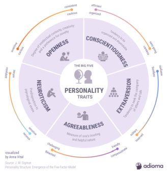
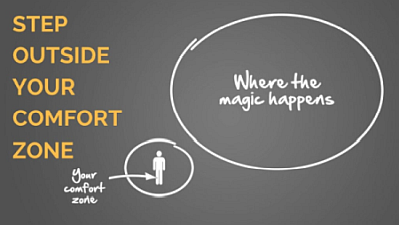
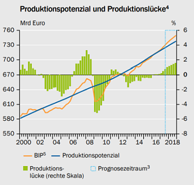

class: title-slide

```{r xaringan-themer, include=FALSE}
library(xaringanthemer)
style_xaringan(text_color = "#232461",inverse_text_color = "#FFFFFF",inverse_background_color = "#232461", title_slide_background_color = "#232461",header_background_color = "#232461",header_color = "#FFFFFF",header_h1_font_size = "32px",
  header_h2_font_size = "26px",link_color="#d84116",
  header_h3_font_size = "20px",text_slide_number_color = "#232461",text_slide_number_font_size = "0.5em")
```

```{r xaringanExtra, echo=FALSE}
xaringanExtra::use_xaringan_extra(c("tile_view","scribble","panelset","tachyons"))
xaringanExtra::style_panelset_tabs(font_family = "inherit")
#xaringanExtra::use_search(show_icon = TRUE)
#weitere: "share_again","animate_css", "webcam","freezeframe","clipboard","fit_screen","extra-styles" 
xaringanExtra::use_editable(expires = 1)
``` 

```{r setup, include=FALSE}
options(htmltools.dir.version = FALSE)
```


# VO Makroökonomie


## Intake 2020B  

### Prof. Dr. Jörg Schoder


# CORE Unit 13 (Wirtschaftliche Aktivität: Messung und Schwankungen)


---

layout: true

<div class="my-footer"></div>       


---
name: Lernziele
class: inverse, left, middle
# Was lernen wir?

.small[In Einheit 1 und 2 wurde die Bedeutung des technologischen Fortschritts für die langfristige Entwicklung des Wohlstands deutlich. In Einheit 4 und Einheit 5 haben wir uns mit individuellen Entscheidungen und sozialen Dilemmata befasst. Die individuellen Entscheidungen (z.B. "wieviel spare ich"?) sind dabei auch abhängig von makroökonomischen Entwicklungen (Einkommen, Arbeitslosigkeit, Preise), die zum Teil deutlich vom langfristigen Trend abweichen können. Diese Schwankungen bezeichnen wir als Konjunkturzyklus.]

## Inhaltliche Leitfragen

.blockquote[.small[
1. Warum gibt es wirtschaftliche Schwankungen und wie wirken sie sich auf die Lebensqualität aus? 
3. Wie reagieren Haushalte und Unternehmen auf Schwankungen? Und welche Rückwirkungen hat dies auf die Konjunktur?
]
]

## Ökonomische Methoden und Konzepte 

.blockquote[.small[
1. Wirtschaftskreislauf und Volkswirtschaftliche Gesamtrechnungen (VGR)
2. Konjunkturzyklus und die Rolle von Konsum und Investitionen
3. Inflation und Arbeitslosigkeit
]
]


---
name: Kuznets
class: left

# Kuznets-Kurve(n)


.panelset[
.panel[.panel-name[Umwelt]
```{tikz ,echo=FALSE, message=FALSE}
{\sffamily
  \begin{tikzpicture}[scale=.5,xscale=1.5,thick]
			\usetikzlibrary{calc}   %allows coordinate calculations.
			
			\draw[-stealth] (0,0) -- (10,0);
			\node[thick,below]  at (5,0) {BIP pro Kopf}; 
			\draw[-stealth] (0,0) -- (0,10);
			\node[thick, above, rotate=90] at (0,5) {Umweltverschmutzung}; 
		
			\draw[blue,domain=0:9,smooth] plot (\x,{(-.3*((\x-4.5)^2)+8)}) node[below right] {};
			\draw[blue,dotted] (4.5,0)--(4.5,8);
  
    	\draw (2,6.125) node[pin={[pin distance=1.7em]91:Industrialisierung}] {};
			\draw (7,6.125) node[pin={[pin distance=1.7em]89:Tertiärisierung}] {};
		\end{tikzpicture}
}
```
]
.panel[.panel-name["Original"]
```{tikz ,echo=FALSE, message=FALSE}
{\sffamily
  \begin{tikzpicture}[scale=.5,xscale=1.5,thick]
			\usetikzlibrary{calc}   %allows coordinate calculations.
			
			\draw[-stealth] (0,0) -- (10,0);
			\node[thick,below]  at (5,0) {BIP pro Kopf}; 
			\draw[-stealth] (0,0) -- (0,10);
			\node[thick, above, rotate=90] at (0,5) {Ungleichheit}; 
		
			\draw[blue,domain=0:9,smooth] plot (\x,{(-.3*((\x-4.5)^2)+8)}) node[below right] {};
			\draw[blue,dotted] (4.5,0)--(4.5,8);
		\end{tikzpicture}
}
```
]
]

???

* Anknüpfend an die Diskussion zur Umweltproblematik gibt vielleicht die Umwelt-Kuznets-Kurve Hoffnung.
  * Industrialisierung führt zu hoher Umweltbelastung
  * Anschließende Tertiärisierung mit "grünem Wachstum"
  * Angesprochen damit auch das Thema: Strukturwandel

* Ursprüngliche Kuznets-Kurve bezieht sich auf die Einkommensverteilung.
* Erklärung von Kuznets basiert auf einer Ökonomie, die sich von landwirtschaftlicher Prägung hin zur Industriegesellschaft entwickelt.
  * Zu Beginn sind alle Arbeiter in der Landwirtschaft beschäftigt und haben ungefähr gleiche Einkommen. 
  * Vergleichsweise hohe Produktivität im Industriesektor führt zu ungleicher Einkommensverteilung. 
  * Im Laufe der Industrialisierung verringern sich die Gewinnmöglichkeiten in der Industrie (Konkurrenz erodiert Innovationsrenten)...
  * ...während die Qualifizierung der Arbeiter es ihnen ermöglichen, hohe Stundenlöhne zu verhandeln 
  * eine Marktdynamik wirkt somit der ursprünglich wachsenden Ungleichheit entgegen.
  * Die Ungleichheit lässt auch Sozialprogramme wahrscheinlich werden, mit welchen der Wohlstand gleichmäßig verteilt werden soll. Dadurch sinkt die Ungleichheit wieder. 
  * Über die Zeit gesehen umgekehrt-U-förmiger Verlauf der Ungleichheit

* Bis in die 1970er Jahre war die Kuznets-Kurve ein relativ unumstrittener Zusammenhang. In den 1980er und 1990er Jahren stieg die Ungleichheit in den OECD-Staaten jedoch wieder an.
* Zahlreiche wissenschaftliche Arbeiten widerlegen den von Kuznets aufgestellten Zusammenhang seitdem


---
name: Teil1
class: inverse, center, middle


# Teil 1

## "If you can’t measure it, you can’t improve it." (P. Drucker)

.blockquote[Was wollen (sollten) wir messen?]

.blockquote[Was könn(t)en wir messen?]

.blockquote[Was messen wir? Woran wird Politik gemessen?]


???

Peter Ferdinand Drucker veröffentlichte zwischen 1940 und seinem Tod 2005 zahlreiche **einflussreiche Werke über Theorie und Praxis des Managements**. Er gilt als ein **Pionier der modernen Managementlehre** und als origineller und unabhängiger Denker. Drucker bemühte sich in seinen Werken um Klarheit und Übersicht. Auf einen wissenschaftlichen Apparat und Mitarbeiterstab verzichtete er weitgehend. Seine 35 Bücher wurden über 5 Millionen Mal verkauft.


---
name: Capab
class: left

# Steigerung der Produktivität und Einkommen...

##... oder Steigerung der persönlichen Freiheit?

Der Fähigkeiten-Ansatz von A. Sen

.center[
<iframe width="650" height="360" src="https://www.youtube.com/embed/BunGwSCuksE" title="YouTube video player" frameborder="0" allow="accelerometer; autoplay; clipboard-write; encrypted-media; gyroscope; picture-in-picture" allowfullscreen></iframe>
]

* Gleichheit, Gerechtigkeit
* Ergebnisorientierung vs. Prozessorientierung

???

* Fähigkeiten. Es kommt nicht darauf an, was ich habe, sondern was ich damit machen kann:
  * Bsp. wenn eine Person mit Handicap ein Fahrrad bekommt, kann sie damit nichts anfangen, auch
  wenn ihr materieller Wohlstand vermeintlich gestiegen ist.
* Konzept ist schwer messbar!

* Alternatives Video [Capabilities Approach](https://www.youtube.com/watch?v=rKKs1rqdlmo)


---
name: QualiLife
class: left

# Wohlstand, Lebensqualität und Lebenszufriedenheit


## [Stiglitz/Sen/Fitoussi-Kommission (2009):](https://ec.europa.eu/eurostat/documents/8131721/8131772/Stiglitz-Sen-Fitoussi-Commission-report.pdf) Lebenszufriedenheit ist mehrdimensional. 

The 8+1 dimensions of quality of life:

--
  * Material living standards (income, consumption and wealth)

--

  * Health
 
--

  * Education

--

  * Personal activities including work

--

  * Political voice and governance

--

  * Social connections and relationships

--

  * Environment (present and future conditions)

--

  * Insecurity, of an economic as well as a physical nature


???

* Soziale Verbindungen, Beziehungen
  * Zusammenhang mit der Wahrnehmung einer Gesellschaft als Fair/Gerecht:
  * Wettbewerb und Ellenbogengesellschaft
  * Winner-Takes-All-Probleme

* Statische Ungleichheit vs. Soziale Mobilitität


---
name: OECD-BLI
class: left

# OECD Better-Life-Index


<iframe src="http://www.oecdbetterlifeindex.org/de/" loading="lazy" style="width: 100%; height: 550px; border: 0px none;"></iframe>

.quelle[Quelle: [oecdbetterlifeindex.org](http://www.oecdbetterlifeindex.org/de/)]


---
name: NAWI-D
class: left

# Nationaler Wohlstandsindex

```{r, echo=FALSE,out.width = "100%"}
knitr::include_graphics('images/unit13/NAWI-D_(Ipsos_2020).png')
```

.quelle[[www.ipsos.com/](https://www.ipsos.com/de-de/nationaler-wohlstandsindex-fur-deutschland-corona-sorgt-fur-leichten-wohlstandsdampfer)]

???

* Im Frühjahr 2012 konzipierten das Meinungsforschungsinstitut Ipsos und der Zukunftsforscher Prof. Dr. Horst W. Opaschowski ein neues Wohlstandsbarometer als Basis für einen umfassenden Nationalen WohlstandsIndex für Deutschland (NAWI-D), das seitdem kontinuierlich quartalsweise erhoben wird.

* In der Studie werden folgende Fragen an die Teilnehmer gerichtet:
  * Was verbinden sie mit dem Wort Wohlstand ?
	* Welche Bedingungen müssen erfüllt sein, um wohlhabend zu sein ?
	* Wie schätzen sie ihren persönlichen Wohlstand ein ?
	* Welche Zukunftsängste haben sie?
	
* Antworten werden in drei Kategorien unterteilt (siehe Abbildung)

* Basierend auf den Ergebnissen der Studie wurde ein Modell zur Definition von Wohlstand entwickelt, dass auf vier Arten des Wohlstandes beruht, die den Begriff Wohlstand als Ganzes definieren:
	* Gesellschaftlicher Wohlstand; Leben in einer freien und friedlichen Gesellschaft
	* Individueller Wohlstand; Gesund und ohne Zukunftsängste leben
	* Ökonomischer Wohlstand; ohne Geldsorgen leben
	* Ökologischer Wohlstand; naturnah und nachhaltig leben


---
name: 
class:

# Inequality Beyond GDP...

##...oder auch mal eine positive Nachricht (!)

```{r, echo=FALSE,fig.align='center'}
knitr::include_graphics('images/unit13/Inequality_beyond_GDP_small.PNG')
```

.quelle[[voxEu.org](https://voxeu.org/vox-talks/inequality-beyond-gdp)]

???

* Spanischer Wirtschaftshistoriker Leandrow de la Escosura hat den Capabilities-Approach operationalisiert.
* Ergebnisse zeigen, dass die soziale Ungleichheit im historischen Vergleich abgenommen hat.


---
name: narrativeEcon
class: left

# Exkurs: Narrative Economics

.center[
<iframe width="800" height="550" src="https://www.youtube.com/embed/SCNzE3FbVEY" title="YouTube video player" frameborder="0" allow="accelerometer; autoplay; clipboard-write; encrypted-media; gyroscope; picture-in-picture" allowfullscreen></iframe>
]

???

* Menschen sind narrative Wesen - Geschichten-Erzählen gehört schon seit den Höhlenmenschen
zu unserer Kultur
* Welche Geschichte erzählen wir? bzw. die Medien? die Sozialen Medien?
* Fakten im Post-faktischen (Trump) Zeitalter? und Überforderung der Menschen?
* Narrative und Erwartungen


---
name: PersDev1
class: left

# Exkurs: Persönliche Entwicklung


```{r, echo=FALSE,fig.align='center'}

```

* Persönlichkeit bzw. Charaktereigenschaften ändern sich allenfalls langsam.
*	Voraussetzungen für selbstgesteuerte Veränderungen der Persönlichkeit? [Hennecke et al. (2014)](https://www.researchgate.net/publication/262063688_A_three-part_framework_for_self-regulated_personality_development_across_adulthood_European_Journal_of_Personality)

.quelle[Bildquelle: [blog.adioma.com](https://blog.adioma.com/5-personality-traits-infographic/)]
???

* Voraussetzungen für selbstgesteuerte Veränderungen der Persönlichkeit nach Hennecke et al. (2014)
  1. Wunsch nach Veränderung des eigenen charakterlich bedingten Verhaltens als Selbstzweck oder um bestimmte Ziele zu erreichen
	2. Die Verhaltensänderungen müssen als realistisch und umsetzbar erscheinen
  3. Verhaltensänderungen müssen zu Gewohnheiten (habits) werden, um eine stabile Charaktereigenschaft herauszubilden 
	
* After elaborating on these three conditions, we review **evidence attesting to the importance of motivation and self-regulation for trait development**. We conclude with a discussion of the mutual interdependence of traits and goals as well as the limits of self-regulated personality change. 
* From our framework we derive why **personality changes across adulthood tend to be small to medium only**, namely because they may require that all three preconditions for self-regulated personality change are fulfilled. We provide reasons for why people might not view change as desirable, feasible, or fail to maintain it over time.


---
name: PersDev2
class: left

# Persönliche Entwicklung und Lebenszufriedenheit

* Umfeld/Umwelt können Persönlichkeitsentwicklung anstossen (Austauschstudierende, [Hutteman et al. 2014)](https://www.researchgate.net/publication/263672998_Wherever_I_May_Roam_Processes_of_Self-Esteem_Development_From_Adolescence_to_Emerging_Adulthood_in_the_Context_of_International_Student_Exchange)


```{r, echo=FALSE,fig.align='center'}

```
.quelle[Bildquelle: [vocal.media](https://vocal.media/motivation/you-re-now-leaving-the-comfort-zone)]

* Persönlichkeitsentwicklung $\Rightarrow$ Selbstachtung/Selbstwert $\Rightarrow$  Beruflicher Erfolg $\Rightarrow$  Lebenszufriedenheit

* **Identity Economics:** Verständnis der Motivation entscheidend für die Erklärung menschlichen Verhaltens und die Entwicklung ökonomischer Modelle!


---
name: GDP-QLife
class: left

# Lebenszufriedenheit und Einkommen


<iframe src="https://ourworldindata.org/grapher/gdp-vs-happiness" loading="lazy" style="width: 100%; height: 550px; border: 0px none;"></iframe>


---
name: Teil2
class: inverse, center, middle

# Teil 2


## Wirtschaftliche Schwankungen


.blockquote[Wachstum vs. Konjunktur]

.blockquote[Konjunkturzyklen]


---
name: Wachstum
class: left

# Ausgangspunkt: Langfristige Wirtschaftsentwicklung

```{r, echo=FALSE,fig.align='center'}
knitr::include_graphics('images/unit13/bpb_langeReihe_BIP_(Metz_2015).png')
```


.quelle[[Bundeszentrale für politische Bildung (2015)](http://www.deutschland-in-daten.de/wp-content/gallery/Abbildungen/13-abb-1.png)]

???
* Langfristige Betrachtung des realen BIP
* Anstieg des Index von 3,6 (1850) auf 2643,9 (2012), das entspricht einer jährlichen Wachstumsrate von
durchschnittlich 4,18 Prozent.

* Aber die Grafik zeigt schon, dass wir im Zeitverlauf deutliche Schwankungen hatten, nicht 
nur in den Kriegszeiten

* Schauen wir uns die Schwankungen seit den 1970er Jahren genauer an

---
name: Wachstumsraten
class: left

# Wachstumsraten seit 1970

```{r, echo=FALSE,fig.align='center'}
knitr::include_graphics('images/unit13/Wachstumsraten_(destatis_2021_S10).png')
```


.quelle[[Statistisches Bundesamt (2021, S. 10)](https://www.destatis.de/DE/Themen/Wirtschaft/Volkswirtschaftliche-Gesamtrechnungen-Inlandsprodukt/Publikationen/Downloads-Inlandsprodukt/zusammenhaenge-pdf-0310100.pdf?__blob=publicationFile&v=6)]


???


* Wir sehen auf Seite 10: 7 Jahre mit negativen Wachstumsraten seit 1970 

* Lange Frist [BpB (2015)](http://www.deutschland-in-daten.de/wp-content/gallery/Abbildungen/13-abb-2.png)

* Seit dem 2. Weltkrieg: Negative Wachstumsraten in **acht
Kalenderjahren** (**1967**, 1975, 1982, 1993, 2002, 2003, 2009, 2020)!

* Zunächst wollen wir ein paar Begriffe klären und wir beginnen mit der Unterscheidung
von Konjunktur und Wachstum


---
name: Definition
class: left

# Konjunkturbegriff und -phasen

.panelset[.panel[.panel-name[Definition]
.blockquote[
Als Konjunktur werden *Schwankungen* der wichtigen makroökonomischer Aggregate
(Produktion, Beschäftigung und Preise,...) in *marktwirtschaftlich*
organisierten Volkswirtschaften bezeichnet, wobei die Schwankungen eine *gewisse Regelmäßigkeiten* aufweisen.
]
]
.panel[.panel-name[Phasen]
```{r, echo=FALSE,fig.align='center'}
knitr::include_graphics('images/unit13/Konjunkturzyklus_(Perret_Welfens_2016_S335).png')
```

<br> 

.quellePan[Quelle: Perret/Welfens (2016, S. 335)]
]
]


???

* Etymologie des Konjunkturbegriffs:
  * "conjunctio rerum omnium- eine das Dasein geheimnis- und unheilvoll verknüpfende Schicksalskette"(3. Jh. V. Ch.)
  * später: "Konjunktur als Synonym für eine "gute Geschäftslage"

* "Konjunktur" ist im allgemeinen Sprachgebrauch eine Bezeichnung
für die gesamtwirtschaftliche Lage.
* In der **Fachsprache** sind mit "Konjunktur" die zyklischen
Schwankungen um den langfristigen Trend der wirtschaftlichen
Entwicklung gemeint.
* Typischerweise sind kurzfristige Schwankungen mit Zyklus von 4
bis 6 Jahren.
* Wir werden gleich sehen, dass sich Zyklen mit unterschiedlichen
Dauern überlagern

* Zyklen von einem Hoch zum nächsten Hoch

* **Rezessionen** (teil der Abschwungphase) meist als Perioden definiert,
in denen die preis-, saison- und kalenderbereinigten
Vierteljahreswerte des Bruttoinlandsprodukts (BIP) **mindestens zwei
Vierteljahre in Folge rückläufig** sind (technische Rezession).

* Rezession relativ klar definiert, auch wenn sich die Definitionen im Detail unterscheiden
  * Null oder negatives Wachstum über einen Zeitraum von mehreren Monaten (in D: sechs)

* Unklarer ist, was unter einer Depression zu verstehen ist
  * ein gemeinsamer Nenner ist, dasss es bei der Depression  um einen längeren Zeitraum
  wirtschaftlicher Schwäche geht und viele Menschen in Not bringt
  
* [Robert Hall (2011)](https://web.stanford.edu/~rehall/Long%20Slump.pdf) führte noch einen weiteren Begriff ein: Slump
  * A slump **begins with a contraction**, usually fairly **brief, at least in comparison to the extended period of slow growth that follows** the contraction. 
  * Relative to the vocabulary of peaks and troughs, a slump lasts from the time when employment falls below its normal level during the contraction to the time when employment regains its normal level during an expansion.


---
name: Okun
class: left

# Wachstum und Beschäftigung (Okun's Gesetz)

.panelset[
.panel[.panel-name[Entwicklung]
```{r, echo=FALSE,fig.align='center',out.width='100%'}
knitr::include_url('https://www.core-econ.org/the-economy/book/images/web/figure-13-03-d.jpg',height='470px')
```
]
.panel[.panel-name[Okun's Gesetz]
```{r, echo=FALSE,fig.align='center'}
knitr::include_url('https://www.core-econ.org/the-economy/book/images/web/figure-13-05.jpg',height='470px')
```
]
]


???

* Okun’s Law = a strong and stable relationship between unemployment and GDP growth. 
* Changes in the rate of GDP growth are negatively correlated with the unemployment rate.
* Output falls -- Unemployment rises -- Well-being falls

* Regressionsmodell
  * Ermöglicht Prognosen: Wie stark wirkt sich rückläufiges Wachstum im Durchschnitt
  auf die Beschäftigung aus?
  * Finanzkrise 2009:
    * Deutschland: unterdurchschnittlicher Rückgang der Beschäftigung. Warum?
    Kurzarbeitergeld + Konjunkturprogramm (u.a. Abwrackprämie - Finanzierung?)
    * Spanien: deutlich heftiger als im Durchschnitt der Landesgeschichte. Warum?
    Überschuldete Haushalte (Immobilienkrise), Zukunftsangst größer (Erwartungen)  
* Aber dazu später mehr
* Jetzt erstmal noch einige Grundbegriffe, damit wir eine gemeinsame Sprache finden,
um die Phänomene zu beschreiben und die Probleme zu analysieren


---
name: Zyklen
class: left

# Konjunktur und Konjunkturzyklen


.panelset[.panel[.panel-name[Statistik]
```{r, echo=FALSE,fig.align='center'}
knitr::include_graphics('images/unit13/Zyklen.png')
```

<br>

.quellePan[Quelle: [Savoiu/Manea (2014)](https://www.revistadestatistica.ro/wp-content/uploads/2014/05/RRS01_2014_A1.pdf).]

]
.panel[.panel-name[Kondratieff]
```{r, echo=FALSE,fig.align='center'}
knitr::include_url('https://www.researchgate.net/profile/Gerhard-Posch/publication/318360851/figure/fig2/AS:515180092026881@1499839913439/Kondratieff-Zyklen-Technische-Innovationen_W640.jpg')
```

<br>

.quellePan[Quelle: [Posch/Bruckner (2017)](https://www.researchgate.net/publication/318360851_Schweisstechnik_im_Zeichen_von_Internet_of_Things_und_Industrie_40)]
]
]


???

* Juglar-Zyklus (sieben bis elf Jahre); 
  * 1860 von C. Juglar festgestellt; 
  * dieses ist der Konjunkturzyklus i.e.S;
* Kitchin-Zyklus (drei bis vier Jahre)
  * auch als Mitchell-Zyklus bezeichnet; 
  * 1923 von J. Kitchin in den USA und Großbritannien festgestellt; **Existenz umstritten**;
* Kondratieffzyklus (50 bis 60 Jahre); 
  * 1926 von N.D. Kondratieff festgestellt. 
  * Interpretation als Basisinnovationen


---
name: WachstumKonjunktur
class: left

# Theorie: Wachstum vs. Konjunktur

.panelset[
.panel[.panel-name[Wachstum]
```{tikz ,echo=FALSE, message=FALSE}
{\sffamily
	\begin{tikzpicture}[scale=.65]
	\draw[-stealth,very thick] (0,0) -- (0,5.6) node [left] {$Y$};  
	\draw[-stealth,very thick] (0,0) -- (5.1,0)  node [below] {$X$};
	\draw[color=black,very thick] (0,4.1) ..controls (2,3.7) and (3.3,2) .. (3.4,0);
	\draw [-stealth,very thick] (2.6,2.8) -- (3,3.1);
	\draw[color=black,very thick] (0,5.1) ..controls (2,4.9) and (4.3,2.5) .. (4.4,0);
	\node [left] at (0,4.1) {$F$};
	\draw [fill] (0,4.1) circle [radius=.1];
	\node [above left] at (3.4,0) {$G$};
	\draw [fill] (3.4,0) circle [radius=.1];
	\end{tikzpicture}	
}
```
.quellePan[Eigene Darstellung.]
]
.panel[.panel-name[PPF]
* Transformationskurve (PPF - Production Possibilities Frontier)  
  * Welche Güter können mit der aktuellen Technologie hergestellt werden
  * Knappheit der Ressourcen und Trade-off (bspw. Autos vs. Beatmungsgeräte)
  * Produktivitätswachstum als Verschiebung der Transformationskurve

* Einflussfaktoren:
  * Natürliche Ressourcen: Boden/Land, Rohstoffe (Aber: Curse of
    natural resources, J. Sachs)
  * Institutionen: Rechtsordnung und -durchsetzung, Kultur
  * Technologie und Technologischer Fortschritt
  * Physisches Kapital (K): Maschinen, Infrastruktur,. . .
  * Arbeitskraft (L): Physische Tätigkeiten, Arbeitszeit
  * Humankapital: Wissen, Bildung
  * Sozialkapital: Vertrauen
]
.panel[.panel-name[Konjunktur]
```{tikz ,echo=FALSE, message=FALSE}
{\sffamily
  	\begin{tikzpicture}[scale=.65]
		\draw[-stealth,very thick] (0,0) -- (0,5.6) node [left] {$Y$};  
		\draw[-stealth,very thick] (0,0) -- (5.1,0)  node [below] {$X$};
		\draw[color=black,very thick] (0,4.1) ..controls (2,3.7) and (3.3,2) .. (3.4,0);
		\draw [fill] (0,4.1) circle [radius=.1];
		\draw [fill] (3.4,0) circle [radius=.1];
		\node [left] at (2.08,2.95) {$N$};
		\draw [fill] (2.08,3) circle [radius=.1];
		\node [left] at (2.8,3.5) {$\mbox{Ü}$};
		\draw [fill] (2.8,3.5) circle [radius=.1];
		\node [left] at (1,2) {$R$};
		\draw [fill] (1,2) circle [radius=.1];
		\draw [-stealth] (1.3,2.3) -- (1.75,2.7);
		\end{tikzpicture}
}
```
.quellePan[Eigene Darstellung.]
]
.panel[.panel-name[Outputlücke]
```{r, echo=FALSE,fig.align='center'}

```

<br>
.quellePan[Quelle: [Sachverständigenrat (2017, S. 131)](https://www.sachverstaendigenrat-wirtschaft.de/fileadmin/dateiablage/gutachten/jg201718/jg2017_06_de_konjunktur.pdf)]]
]
]


???
* **Produktionspotenzial**
  * entspricht der gesamtwirtschaftlichen Produktion, wenn alle Produktionsfaktoren   
  (a) maximal ausgelastet sind, ohne Inflationsdruck zu erzeugen.
  (b) normal (96,75 Prozent) beschäftigt (ausgelastet) sind (Definition des
  Sachverständigenrates).
  * Problem: lässt sich schwer messen! Langfristiger BIP-Trend als eine (!) Möglichkeit zur Schätzung des PPs.

* **Produktionslücke**
  * Die Abweichung des tatsächlich realisierten Bruttoinlandsprodukts vom (geschätzten!) Produktionspotenzial wird als Produktionslücke (auch Outputlücke, Output Gap) bezeichnet

  * Produktionslücke als Abweichung vom langfristigen BIP-Trend als eine (!)
Möglichkeit zur Schätzung der Produktionslücke.

Schätzungen anhand von Zeitreihenanalysen, bei denen aus der beobachtbaren
Veränderung der Produktion konjunkturelle Effekte herausgefiltert
werden, um so einen Wachstumstrend zu erhalten. Dieser wird als Veränderung
des Produktionspotenzials interpretiert.


---
name: KonsumInvest
class: inverse, center, middle

# Erklärungen wirtschaftlicher Schwankungen

.blockquote[Konsum im Konjunkturzyklus]

.blockquote[Investitionen im Konjunkturzyklus]


---
name: news
class: left

# Corona-Rezession

```{r, echo=FALSE,fig.align='center',out.width='100%'}
knitr::include_url('https://www.tagesschau.de/wirtschaft/konjunktur/aufschwung-branchen-corona-101.html',height='550px')
```


---
name: Konjunkturtheorien
class: left

# Konjunkturtheorien

* **Angebotstheoretische Erklärungen**

--
  * am Beispiel der Real-Business-Cycles-Theorie (modifiziertes Solow-Modell)
      * technisches Wissen wächst mit schwankenden (durchschnittlich positiven) Raten
      * wechselseitige Beeinflussung der Produktionsfaktoren
  * Konjunktur als amplifizierte **Produktivitätsschocks** (Arnold 2016, S.
140f).

--
* **Nachfragetheoretische Erklärungen**

--
  * Langfristig: Produktion durch die Angebotsseite (Wachstum der Produktionsfaktoren und technischen Fortschritt) bestimmt.
  * Kurzfristig: Produktion entscheidend durch die gesamtwirtschaftliche Nachfrage beeinflusst!
  * vgl. Unit 14 (Keynesianisches Kreuz)

--
* **Politökonomische Erklärungen**

* u.a.m.


???
Shock = an unexpected event (such as extreme weather) which causes GDP to fluctuate.

There are two broad types of shocks:
Good or bad fortune strikes the household
Good or bad fortune strikes the entire economy


---
name: Wachstumsbeitrag
class:

# Wachstumsbeiträge der Nachfragekomponenten

```{r, echo=FALSE,fig.align='center'}
knitr::include_graphics('images/unit13/Wachstumsbeitraege_Nachfragekomponenten_(destatis_2021_S12).png')
```

.quelle[[Statistisches Bundesamt (2021, S. 12)](https://www.destatis.de/DE/Themen/Wirtschaft/Volkswirtschaftliche-Gesamtrechnungen-Inlandsprodukt/Publikationen/Downloads-Inlandsprodukt/zusammenhaenge-pdf-0310100.pdf?__blob=publicationFile&v=6)]


???
* Auf Seite 12 sehen wir die Beiträge der BIP-Nachfragekomponenten zu den
Wachstumsraten 2020
  * Sowohl Konsum rückläufig (-1%)
  * als auch Investition (-6,9%)

* Anders als in *The Economy* betont, konnten wir also im Corona-Jahr 2020 beobachten, dass die Investitionen einen geringeren negativen Effekt auf das Wirtschaftswachstum hatten als der Konsum 

* wie sieht das in "normalen Jahren" aus und was können wir daraus lernen?


---
name: Lifecycle
class: left

# Konsumverhalten und Lebenszyklushypothese

.panelset[
.panel[.panel-name[Optimum]
```{r, echo=FALSE,fig.align='center',out.width='100%'}
knitr::include_url('https://www.core-econ.org/the-economy/book/images/web/figure-13-12-b.jpg
',height='480px')
```
]
.panel[.panel-name[Konsumglättung]
```{r, echo=FALSE,fig.align='center',out.width='100%'}
knitr::include_url('https://www.core-econ.org/the-economy/book/images/web/figure-13-10-c.jpg
',height='480px')
```
]
.panel[.panel-name[Schock]
```{r, echo=FALSE,fig.align='center',out.width='100%'}
knitr::include_url('https://www.core-econ.org/the-economy/book/images/web/figure-13-12-f.jpg
',height='480px')
```
]
]


???

* **Intertemporales Optimum** - Zeichnung ergänzen! 
  * Geringeres Einkommen in Periode 1 und hohes in Periode 2
(sodass auf der Budgetgerade links oben) - rationaler Akteur würde Kredit aufnehmen
  * Hohes Einkommen in Periode 1 und niedriges in Periode 2 (rechts unten auf der BG) - rationaler Akteur würde in Periode 1 sparen

* Entsprechend ergibt sich das **Profil**

* **Schock**

  * Beispiel: Arbeitslosigkeit und Corona
    * S. 5, S. 8: [Deutschland](https://statistik.arbeitsagentur.de/Statistikdaten/Detail/202104/arbeitsmarktberichte/am-kompakt-corona/am-kompakt-corona-d-0-202104-pdf.pdf?__blob=publicationFile&v=1)
    * S.3. [USA](https://fas.org/sgp/crs/misc/R46554.pdf)
  

* Households make lifetime consumption plans based on expectations about the future, and react to shocks:
* Readjust long-run consumption (red line) if shocks are permanent
* Do not change long-run consumption if shocks are temporary

* Consumption smoothing is a **basic source of stabilisation** in an economy.


---
name: ConSmooth
class: left

# Möglichkeiten zur Konsumglättung

* Vorsorge (Self-Insurance)

--
    * Sparen
    * Kreditaufnahme
    
--

* Versicherung (Co-Insurance)

--
    * Grundproblem: Asymmetrische Information
--
        * vorvertraglich: Adverse Selektion 
            * Market(s) for Lemons (G. Akerlof) 
            * Lösungsstrategie: Signalling, Screening
        * nachvertraglich: Moralisches Risiko
            * Verhaltensänderungen nach Abschluss einer Versicherung gefährden die Versicherungsidee
            * Lösungsstrategie:  Monitoring, Screening
            
--
    * Private Versicherungen (freiwilliges Risiko-Pooling)
    * Sozialversicherungen (Zwangs-Pooling)


???

* Zwangspooling als Pareto-Verbesserung

* Co-insurance is less effective if the bad shock hits everyone at the same time.

* But when these shocks hit, co-insurance is even more necessary.

* In **farming economies** of the past that were based in volatile climates, people practised **co-insurance based on trust, reciprocity, and altruism**.

* [Hall (2010)](https://conference.nber.org/confer/2010/MEf10/Hall.pdf): 

  * Stripped to its basics, the story of the paper is that
     * in the years leading up to the slump, households borrowed much more than usual and used the proceeds to buy more houses and cars than usual. 
     * They used the credit market to speed up purchases - they bought first and planned to save later. 
     * In an economy without a floor on it real interest rate, households not subject to borrowing constraints would have taken over purchasing unusual volumes once the constrained households reached their saving phase. 
     * But the interest rate could not fall far enough to induce that response. Instead, output fell and unemployment rose.
  
  * Of course, this story leaves out a lot. 
      * In particular, the crisis of September 2008 is portrayed as only a response to the more fundamental forces of overextended households and not a separate causal factor. 
      * In fact, the increase in financial frictions from the crisis surely made its own contribution.


---
name: Hindernisse
class: left

# Konsumglättung in der Praxis?

.panelset[
.panel[.panel-name[Kreditbeschränkungen]
```{r, echo=FALSE,fig.align='center',out.width='100%'}
knitr::include_url('https://www.core-econ.org/the-economy/book/images/web/figure-13-11-c.jpg
',height='480px')
```
]
.panel[.panel-name[Disziplin]
```{r, echo=FALSE,fig.align='center',out.width='100%'}
knitr::include_url('https://www.core-econ.org/the-economy/book/images/web/figure-13-13-c.jpg
',height='480px')
```
]
]


???

* Weitere Einschränkungen der Konsumglättung durch fehlende Disziplin
  * Weakness of will - inability to commit to beneficial future plans.
  * A household is able to smooth consumption but doesn’t, and may regret it later.

* Limitations to consumption smoothing mean it cannot always stabilise the economy; it may amplify the initial shock.
  * credit constraints
  * weakness of will, 
  * limited co-insurance

* This helps us understand the business cycle and how to manage it. 

* Credit constraints – limits on amount borrowed/ability to borrow.
The households unable to adjust to a temporary income shock have lower welfare.


---
name: Invest
class: left

# Investitionen und selbstverstärkende Effekte

.panelset[
.panel[.panel-name[Abwärtsspirale]
```{r, echo=FALSE,out.width='100%'}
knitr::include_url('https://www.core-econ.org/the-economy/book/images/web/figure-13-15.jpg', height='480px')
```
]
.panel[.panel-name[Aufwärtsspirale]
```{r, echo=FALSE,out.width='100%'}
knitr::include_url('https://www.core-econ.org/the-economy/book/images/web/figure-13-16.jpg', height='480px')
```
]
]


???

* Rolle der Erwartungen

* Bruttoinvestitionen in der VGR = Bruttoanlageinvestitionen + Vorratsinvestitionen (Lager) + Nettozugang Wertsachen (u.a. Edelmetalle)

* Bruttoanlageinvestitionen = Erweiterungsinvestitionen + Ersatzinvestitionen
* Vorratsinvestitionen: Bestände an 
  * nicht dauerhaften Produktionsmitteln wie Roh-, Hilfs- und Betriebsstoffe
  * unfertige Erzeugnisse
  * fertige Erzeugnisse oder Handelswaren.
  


---
name: InvestmentGame
class: left

# Investitionen als Koordinationsspiel


```{r, echo=FALSE,out.width='100%'}
knitr::include_url('https://www.core-econ.org/the-economy/book/images/web/figure-13-17.jpg', height='550px')
``` 


???

* Actors: the two firms

* Actions: Invest, or Do not invest

* Information: they decide simultaneously

* Payoff: profits from investment 

* Investment is the best response to other firms’ investment (coordination game).


---
name: Indikatoren
class: left

# Konjunkturindikatoren und -prognosen


.panelset[
.panel[.panel-name[Indikatoren]
* [ifo Geschäftsklima](http://www.cesifo-group.de/de/ifoHome/facts/Survey-Results/Business-Climate.html)
  * Geschäftslage 
  * Geschäftserwartungen
* [ZEW-Konjunkturerwartungen](http://www.zew.de/de/publikationen/zew-gutachten-und-forschungsberichte/forschungsberichte/konjunktur/zew-finanzmarktreport/)
* [Earlybird-Indikator](https://www.commerzbank.de/media/de/research/economic_research/aktuell_1/early_bird.pdf) (Commerzbank, Wirtschaftswoche)
* [FAZ-Konjunkturindikator](http://www.faz.net/-gqe-rfsb)
* [GfK-Konsumklimaindex](http://www.gfk.com/de/insights/press-release/konsumklima-nimmt-wieder-fahrt-auf/)
* [Einkaufsmanager-Index (EMI)](http://www.bme.de/services/einkaufsmanager-index/)
]
.panel[.panel-name[Vorlaufeigenschaften]
```{r, echo=FALSE,fig.align='center'}
knitr::include_graphics('images/unit13/Konjunkturindikatoren_(Breitung&Jag_2002).png')
```

<br>

.quellePan[Quelle: Breitung/Jagodzinski (2002, S. 11).]
]
]


  
---
name: animalspirits
class: left

# Investitionen und Erwartungen: Die Rolle der Psychologie

```{r ShillerVOX, echo=FALSE,fig.align='center',out.width='100%'}
knitr::include_graphics('images/unit13/Shiller_voxEU.png')
```

.quelle[[Podcast mit Robert Shiller](https://voxeu.org/vox-talks/animal-spirits)]


---
class: inverse, center, middle


# Fazit und Ausblick


---
name: Fazit
class: left

# Zusammenfassung

1. Messung wirtschaftlicher Aktivität nicht trivial
  * Was wollen wir messen? Was können wir messen?
  * Grundverständnis der VGR
     * Entstehungsrechnung
     * Verwendungsrechnung
     * Verteilungsrechnung
  * Reale vs. nominale Größen

2. Wirtschaftswachstum ist ein Prozess, der Schwankungen unterliegt
  * Haushalte wollen Schwankungen ausgleichen, unterliegen aber häufig Kreditbeschränkungen
  * Unternehmen denken bei Investitionen häufig (zu) kurzfristig und können dadurch
   die Schwankungen verstärken.
 


---
name: Aus
class: left

# Ausblick

```{r, echo=FALSE,fig.align='center',out.width='80%'}
knitr::include_graphics('images/unit13/Flattening_Recession_Curve_(Baldwin_2020).PNG')
```


???

* weitere wichtige Nachfragekomponenten
 * Staat (unabhängig vom Vertrauen ins Geschäftsklima)
 * Ausland

* Corona-Rezession
* Staatliche Reaktion
  * Fiskalpolitik (Kurzarbeitergeld, Hilfszahlungen, Konsumgutscheine in den USA...)
  * Geldpolitik
